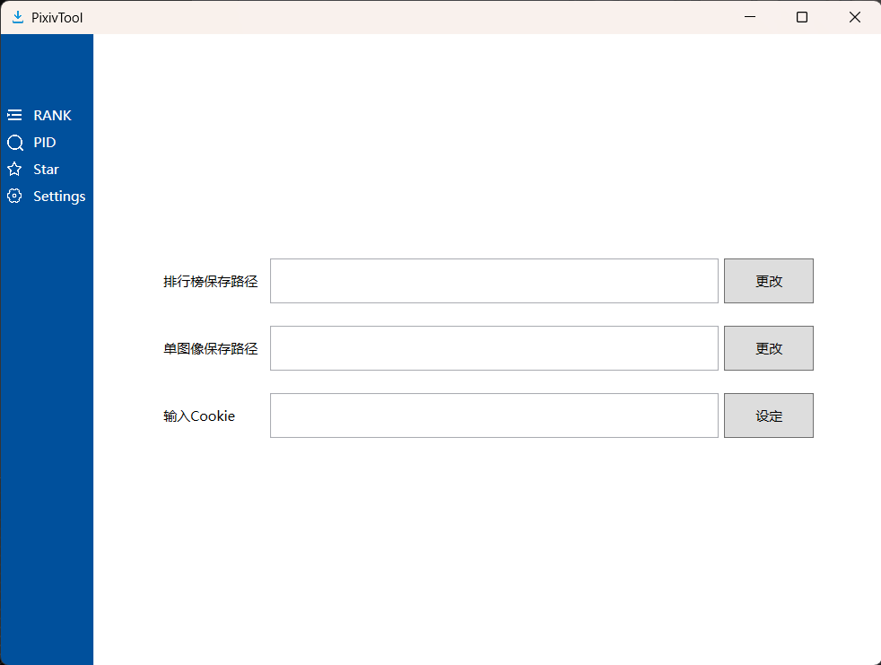
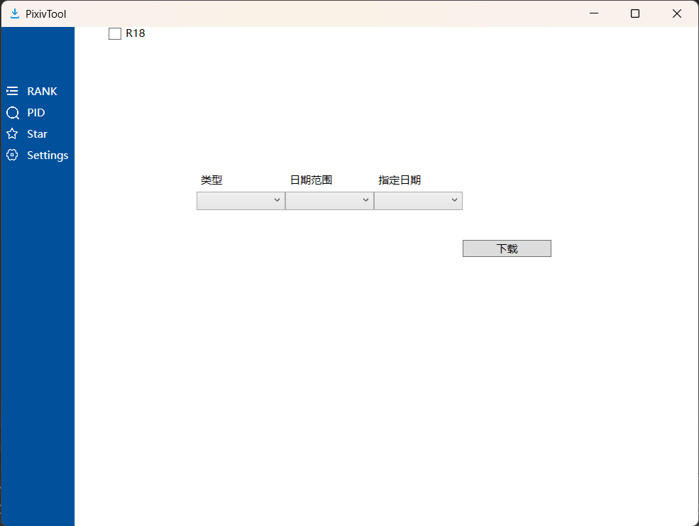
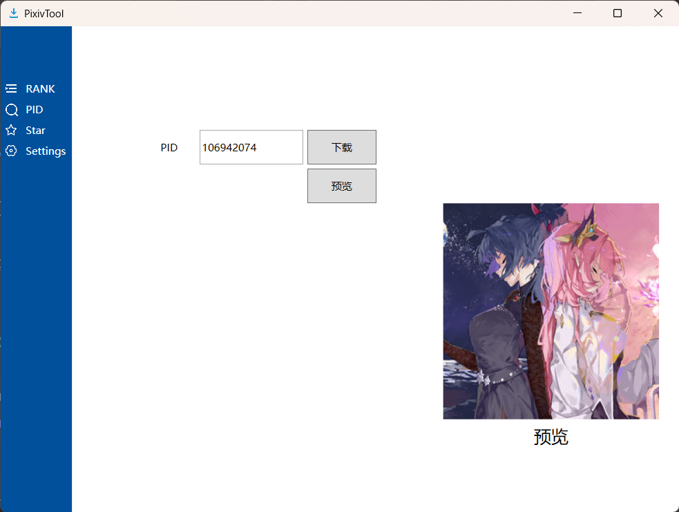

# pixiv-tool
> 用C#重写时忘写了之前的功能，以后再写（）
## 使用
### 运行
+ 此桌面应用基于dotnet 7.0, 如果打开遇到了问题，请[安装.net7.0运行时](https://dotnet.microsoft.com/zh-cn/download/dotnet/thank-you/runtime-desktop-7.0.10-windows-x64-installer)
### 设置
+ 导航栏中的[Settings]()项可以导航至此页面
> **COOKIE的导入**
+ 使用前需要一个登录后的Cookie 
+ 填入后点击”设定“传入Cookie，Cookie会被保存在本地，下次不必再次填写
1. 排行榜保存路径
    + 填入本地绝对路径
    + 点击[更改]()
2. PID搜索图像保存路径
    + 填入本地绝对路径
    + 点击[更改]()
### 排行榜图像下载
+ 目前支持类型，是否R18，以及日期范围的筛选
> 不选择下载选项，默认顺序下载当日排行榜
### 通过PID搜索图像并下载
1. 预览
    + 输入PID，点击预览，可以在右下角预览当前PID的p1
2. 下载
    + 输入PID，点击下载，可以在你设定的目录，或者./pid/中看到下载后的原图
### 收藏夹下载
> 以后再写（）
